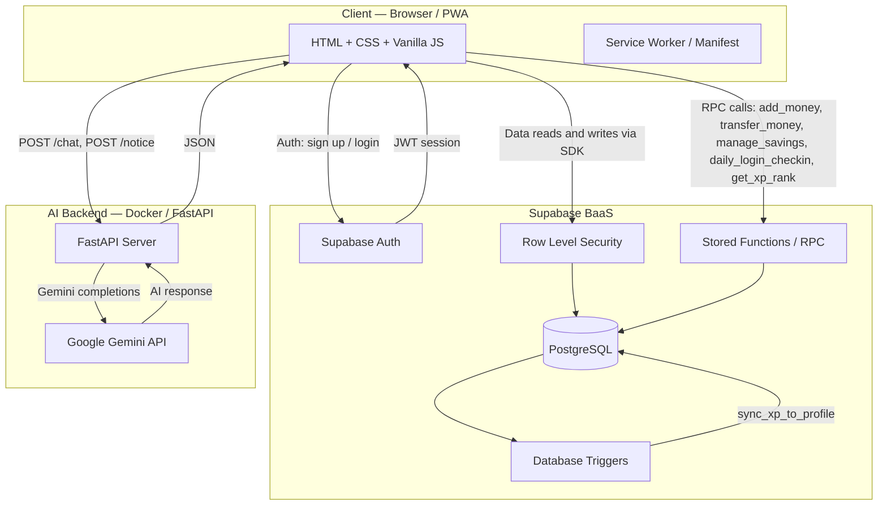
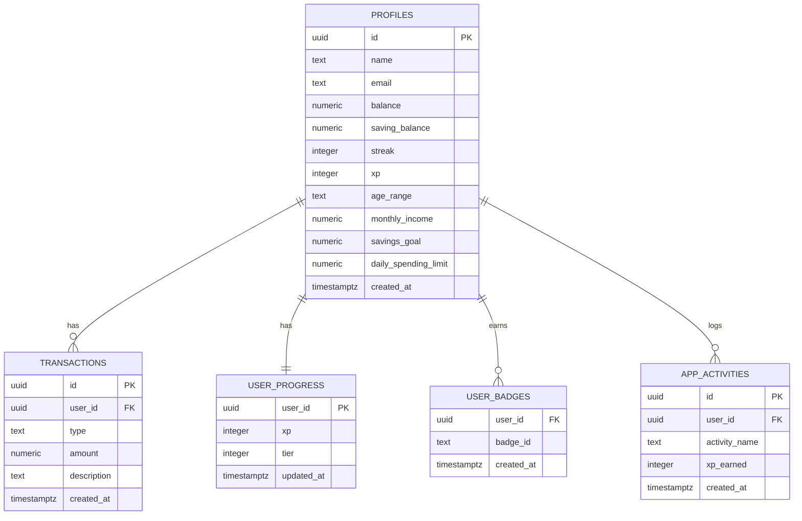
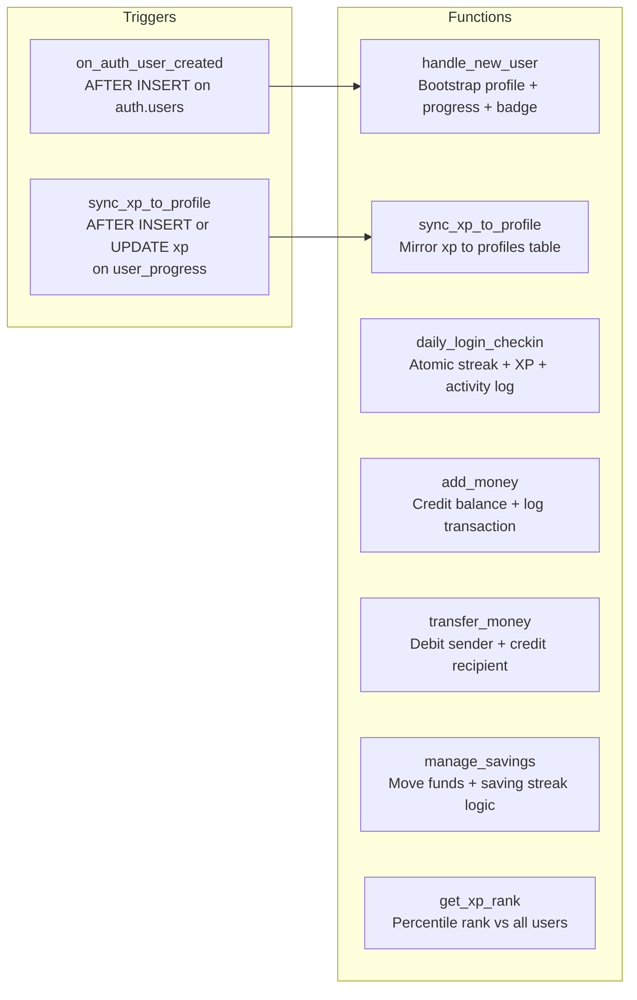
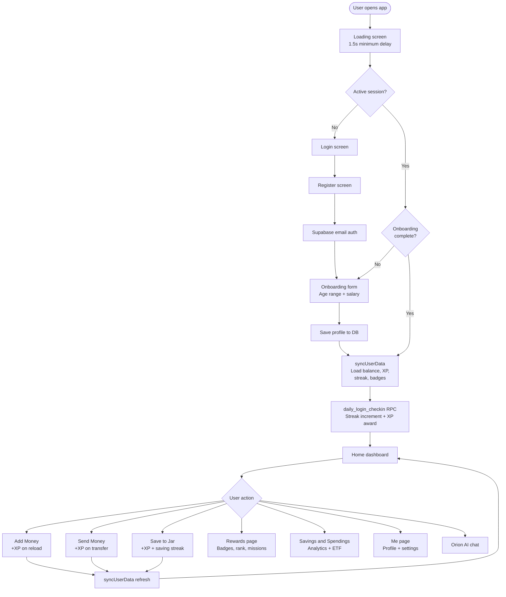
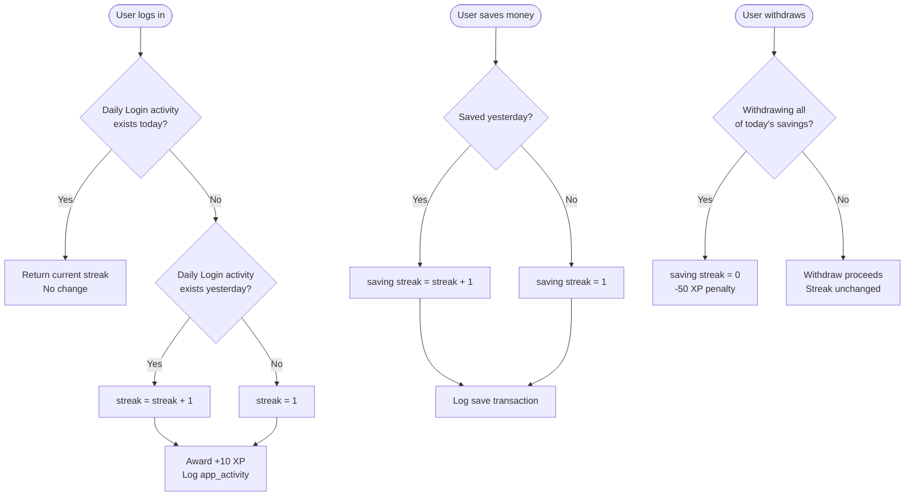
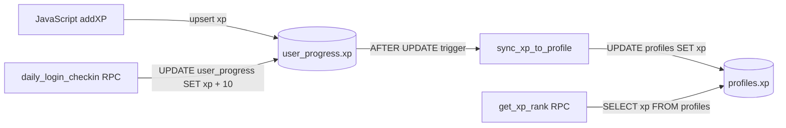
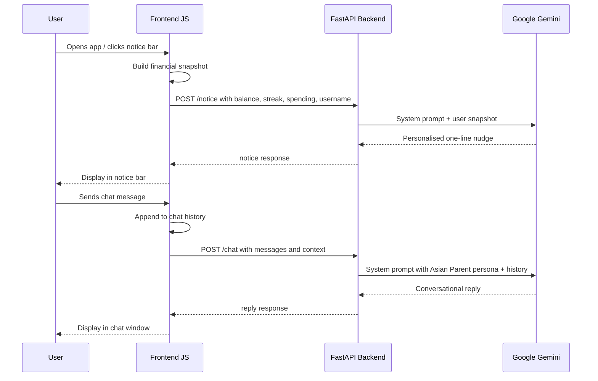
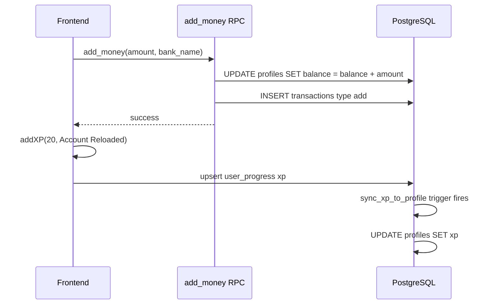
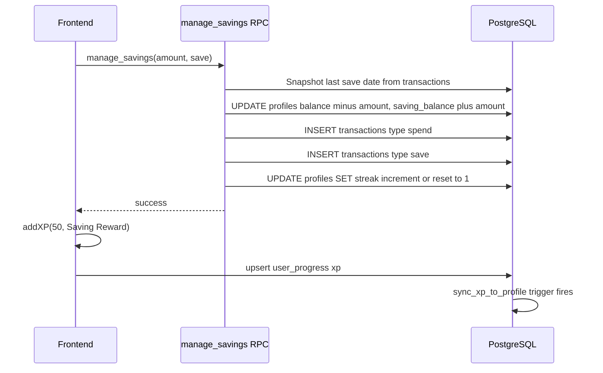

# Project Orion


**AI-powered financial literacy platform designed to guide Malaysian youth toward long-term financial wellbeing.**

---

## Android App Installation

Project Orion is now available as a native Android application! Download and install the APK directly on your Android device.


[](https://drive.google.com/file/d/1MkOXimnvQmjjsPV5VAaw87xUXl5yev3e/view?usp=sharing)


> We support direct Android App Installation — no Play Store required. Enable **Install from Unknown Sources** in your Android settings, then open the downloaded APK to install.

---

## Table of Contents

- [Android App Installation](#android-app-installation)
- [The Problem](#the-problem)
- [Our Solution](#our-solution)
- [Core Features](#core-features)
- [Tech Stack](#tech-stack)
- [System Architecture](#system-architecture)
- [Database Schema](#database-schema)
- [User Journey](#user-journey)
- [Gamification Engine](#gamification-engine)
- [AI System](#ai-system)
- [Data Flow: Key Transactions](#data-flow-key-transactions)
- [Project Structure](#project-structure)
- [Local Development](#local-development)
- [Authors](#authors)

---

## The Problem

Financial illiteracy among Malaysian teenagers and young adults is a quiet but persistent crisis. Studies consistently show that the majority of young Malaysians enter adulthood without the skills to budget, save, or plan for the future. The consequences compound quickly: impulsive spending, debt accumulation, zero savings culture, and a complete lack of investment awareness.

Traditional financial education is reactive — taught in school curricula that are dry, abstract, and disconnected from daily life. Banking apps, meanwhile, are designed for people who already understand money. They present raw numbers with no interpretation, no guidance, and no reward for good behaviour. For a 17-year-old seeing their first salary, these tools offer no signal at all about whether they are heading in the right direction.

Project Orion was built specifically to close this gap.

---

## Our Solution

Project Orion combines a simulated financial wallet with a gamified learning and behaviour system, all coached in real time by an AI assistant that speaks the way Malaysian young people actually communicate.

The core thesis is that financial discipline is a habit, and habits are formed through immediate feedback loops and progressive rewards. Every responsible financial action a user takes — logging in daily, moving money into savings, staying within a spending budget, completing a full week of saving — earns them experience points, advances their tier, and unlocks new badges. The platform makes the invisible visible: instead of abstract lectures about compound interest, users watch their savings jar fill up, their streak counter climb, and their rank against peers rise.

The AI assistant Orion adopts the persona of a Malaysian Asian parent: direct, slightly naggy, warm, and deeply invested in the user's financial future. It responds to the user's actual financial snapshot — current balance, savings progress, daily spending against their budget — and delivers personalised advice in natural Malaysian English. This grounds financial guidance in the user's real context rather than generic advice.

The result is a platform where young people are not lectured at but actively participate in building financial discipline, and are rewarded for doing so.

---

## Core Features

### Financial Wallet

- Account balance management with top-up via Malaysian bank simulation (Maybank, CIMB, Public Bank, RHB, and others)
- Peer-to-peer money transfers by email address with spending category tagging
- Savings jar: a ring-fenced sub-account that tracks saving progress toward a personal goal
- Withdrawal from savings jar with an XP penalty to discourage impulsive drawdowns
- Real-time daily spending ring showing percentage of daily budget consumed, with category breakdown across Food, Transport, Grocery, and Others

### Gamification System

- Ten progression tiers from "No Money No Talk" to "Sultan Simpanan", each requiring cumulative XP
- XP awarded for daily login, account reload, successful money transfer, saving into the jar, and achieving milestones
- Saving streak: consecutive days of saving tracked at the database level and automatically incremented
- Login streak: consecutive daily logins tracked atomically via a PostgreSQL stored function
- Global XP leaderboard showing the user's percentile rank against all platform users
- Badge collection popup displaying all earned and locked badges
- XP penalty applied on savings withdrawal to reinforce commitment

### AI Assistant — Orion

- Conversational chat interface accessible from every screen via a persistent notice bar
- Full financial snapshot injected into every AI session: balance, savings, daily limit, streak, and XP
- Malaysian Asian Parent persona: encourages, nags, and celebrates using natural Malaysian expressions
- Powered by Google Gemini with a cascading model fallback chain ensuring availability
- Personalised daily notice bar message generated from the user's live data on each login

### Financial Analytics

- Multi-ring SVG spending visualisation with concentric circles per spending category
- Animated savings jar that fills based on progress toward the user's defined goal
- Weekly spending trend bar chart
- Milestone progress bar for savings goal
- Detailed breakdown of spending remaining per category

### Discover Module

- ETF Basics educational module introducing exchange-traded fund concepts
- Trending ETF table with market data reference (EWM, SPY, QQQ, GLD, SOXX, and others)
- Savings Goals tutorial content

### User Onboarding

- Age range collection for personalised budget modelling
- Monthly salary input used to compute a recommended daily spending limit automatically
- Savings goal configuration and customisation
- Demo mode for exploring the full platform without creating an account

### Progressive Web App

- Installable on iOS and Android home screens via Web App Manifest
- Full-screen standalone display mode
- Custom splash screen, theme colour, and app icons
- Mobile-first responsive layout

---

## Tech Stack

### Frontend

| Layer | Technology |
|---|---|
| Markup | HTML5 |
| Styling | CSS3 (custom properties, CSS animations, SVG) |
| Logic | Vanilla JavaScript (ES2022, ES Modules) |
| Build Tool | Vite 5 |
| Database Client | @supabase/supabase-js v2 |
| Fonts | Google Fonts — Inter |
| PWA | Web App Manifest + Apple Web App meta tags |

### Backend (AI Service)

| Layer | Technology |
|---|---|
| Language | Python 3.12 |
| Framework | FastAPI 0.115 |
| Server | Uvicorn (ASGI) |
| HTTP Client | httpx (async) |
| Validation | Pydantic v2 |
| AI Model | Google Gemini (gemini-2.5-flash primary, cascading fallback) |
| Containerisation | Docker |

### Database and Auth

| Layer | Technology |
|---|---|
| Database | PostgreSQL (via Supabase) |
| Auth | Supabase Auth (email/password) |
| BaaS | Supabase (REST API, Realtime, RLS) |
| Business Logic | PostgreSQL stored functions (PL/pgSQL) |
| Security | Row Level Security policies on all tables |

---

## System Architecture



---

## Database Schema



### Database Triggers and Stored Functions



---

## User Journey



---

## Gamification Engine

### XP Award Table

| Action | XP Awarded | XP Penalty |
|---|---|---|
| Daily Login | +10 | — |
| First Account Reload | +10 | — |
| Account Reloaded | +20 | — |
| Money Sent (Demo) | +15 | — |
| Successful Transfer | +30 | — |
| Saving Goal Progress (Demo) | +50 | — |
| Saving Reward | +50 | — |
| Withdrawal (jar drawdown) | — | -50 |

### Tier Progression

```mermaid
graph LR
    T1["Tier 1\nNo Money No Talk\n0 XP"] --> T2["Tier 2\nCoin Sniffer\n100 XP"]
    T2 --> T3["Tier 3\nOne Ringgit Millionaire\n250 XP"]
    T3 --> T4["Tier 4\nSikit-Sikit Jadi Bukit\n500 XP"]
    T4 --> T5["Tier 5\nWallet Protector\n800 XP"]
    T5 --> T6["Tier 6\nBajet Survivalist\n1,200 XP"]
    T6 --> T7["Tier 7\nCha Ching Apprentice\n1,700 XP"]
    T7 --> T8["Tier 8\nTabung Boss\n2,300 XP"]
    T8 --> T9["Tier 9\nLowkey Kaya\n3,000 XP"]
    T9 --> T10["Tier 10\nSultan Simpanan\n4,000 XP"]
```



### Streak System



### XP Sync Architecture



---

## AI System

### Architecture



### Gemini Model Fallback Chain

The backend attempts each model in sequence until one succeeds:

```
gemini-3.1-flash-lite-preview
        |
gemini-2.5-flash
        |
gemini-2.0-flash
        |
gemini-2.5-flash-lite
        |
gemini-2.0-flash-lite
```

---

## Data Flow: Key Transactions

### Add Money



### Save to Jar



---

## Project Structure

```
project-orion/
|
|-- index.html              # Single-page application shell
|-- script.js               # All frontend logic (auth, wallet, gamification, AI, UI)
|-- style.css               # Full design system (dark purple theme, animations)
|-- supabase.js             # Supabase client initialisation
|-- vite.config.js          # Vite build configuration
|-- manifest.json           # PWA web app manifest
|-- favicon.svg             # App icon (SVG)
|-- logo.png                # App logo (PNG, used as PWA icon)
|-- database_schema.sql     # Full PostgreSQL schema, RLS policies, stored functions
|-- package.json            # Frontend dependencies and build scripts
|
|-- assets/
|   |-- badges/             # Colour badge SVGs (b1.svg through b10.svg)
|   |   |-- black/          # Greyscale locked badge variants
|   |-- jar/                # Savings jar fill-level SVGs (1.svg through 9.svg)
|
|-- backend/
    |-- main.py             # FastAPI application: /chat and /notice endpoints
    |-- requirements.txt    # Python dependencies
    |-- Dockerfile          # Container definition (python:3.12-slim)
    |-- .env.example        # Environment variable template
    |-- .env                # Local secrets (not committed)
```

---

## Local Development

### Prerequisites

- Node.js 18 or later
- Python 3.12
- A Supabase project (free tier is sufficient)
- A Google AI Studio API key

### Frontend Setup

```bash
# Install dependencies
npm install

# Create environment file
cp .env.example .env
# Add your Supabase URL and anon key to .env

# Start development server
npm run dev
```

### Backend Setup

```bash
cd backend

# Create and activate virtual environment
python -m venv venv
source venv/bin/activate
# Windows: venv\Scripts\activate

# Install dependencies
pip install -r requirements.txt

# Configure environment
cp .env.example .env
# Add your GOOGLE_API_KEY to .env

# Start server
uvicorn main:app --reload --port 8080
```

### Database Setup

1. Open your Supabase project dashboard
2. Navigate to SQL Editor and create a new query
3. Paste and run the full contents of `database_schema_example.sql`

The script is idempotent and safe to re-run. It creates all tables, indexes, RLS policies, stored functions, and triggers.

### Running with Docker (Backend)

```bash
cd backend
docker build -t orion-backend .
docker run -p 8080:8080 --env-file .env orion-backend
```

---

## Star History

<a href="https://www.star-history.com/?repos=ninjitsuytber%2FProject-Orion&type=date&legend=top-left">
 <picture>
   <source media="(prefers-color-scheme: dark)" srcset="https://api.star-history.com/chart?repos=ninjitsuytber/Project-Orion&type=date&theme=dark&legend=top-left" />
   <source media="(prefers-color-scheme: light)" srcset="https://api.star-history.com/chart?repos=ninjitsuytber/Project-Orion&type=date&legend=top-left" />
   
 </picture>
</a>

## Authors

| Rank | Author | Contribution |
|---|---|---|
| 1 | [Stephen Sii](https://github.com/ninjitsuytber) | Full Stack — frontend architecture, backend integration, gamification engine, XP and streak system, wallet transaction flows, AI service integration, PWA setup, database design, deployment |
| 2 | [Lee Yun Sheng](https://github.com/leeyunsheng06) | Frontend — UI components and visual refinement, AI assistant integration, spending ring visualisation, notice bar, chat interface |
| 3 | [Chang Cheng Jun](https://github.com/chengjunchang0721) | Frontend — UI refinement, badge system design, quality assurance testing, bug verification across flows |
| 4 | [Kelvin Ng](https://github.com/ngk891796-png) | Frontend — UI components, visual refinement, performance and pressure testing |
| 5 | [Johnathan Ooi](https://github.com/Johnathan0817) | Database — schema construction, stored functions, RLS policies, backend configuration |
